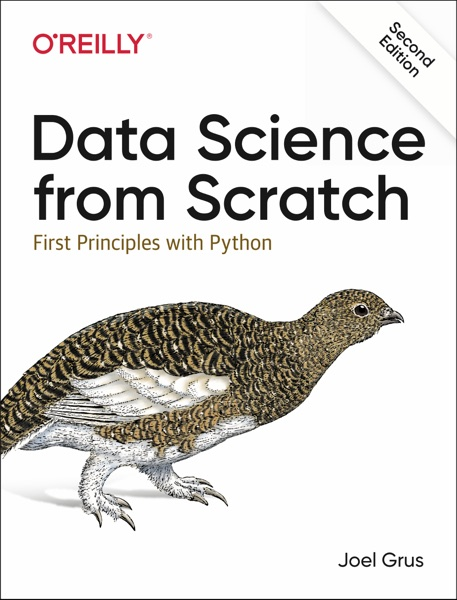

# Bem-vindo {.unnumbered}

Este é o material de apoio da disciplina **Bases 5 — Ciência de Dados**, do curso de **Ciência da Computação** da UnDF.

## Sobre a Disciplina

Você provavelmente já treinou um modelo chamando uma função pronta: um `.fit()`, um `.predict()`, e uma resposta que apareceu sem explicação. Esta disciplina abre essas caixas-pretas.

Todo algoritmo aqui é construído do zero, em Python puro — sem `numpy`, sem `scikit-learn`, sem nada que esconda a mecânica. O código é mais lento e mais verboso do que o de produção, e isso é proposital: o que se ganha é enxergar o que acontece por dentro. No fim de cada seção, depois de você ter construído a coisa, mostramos a chamada de biblioteca equivalente — que a partir dali deixa de ser mágica.

Os temas são:

- Fundamentos: Python para dados, visualização, álgebra linear e gradiente descendente
- Obtenção e preparação de dados
- Aprendizado supervisionado: k-vizinhos, Naive Bayes, regressão linear, logística e árvores de decisão
- Redes neurais e deep learning, construídos camada por camada
- Aprendizado não-supervisionado: clustering

## Cronograma

São 20 encontros, sempre às quartas-feiras, de 19 de agosto a 30 de dezembro de 2026. Os três últimos são avaliativos, e a aula 9 é um horário protegido para estudo (HPE), reservado ao trabalho dos grupos no seminário — cujas instruções saem na aula anterior.

| Aula | Data | Conteúdo |
|:----:|:----:|:---------|
| 1 | 19/08 | Apresentação da disciplina · [1 — Introdução](content/cap01/index.qmd) |
| 2 | 26/08 | [2 — Um Curso Rápido de Python](content/cap02/index.qmd) |
| 3 | 02/09 | [3 — Visualizando Dados](content/cap03/index.qmd) |
| 4 | 09/09 | [4 — Álgebra Linear](content/cap04/index.qmd) · **entrega da [lista 1](atividades/publico/lista-01-revisao.pdf)** |
| 5 | 16/09 | [5 — Gradiente Descendente](content/cap05/index.qmd) |
| 6 | 23/09 | [6 — Obtendo Dados](content/cap06/index.qmd) |
| 7 | 30/09 | [7 — Trabalhando com Dados](content/cap07/index.qmd) |
| 8 | 07/10 | [8 — Machine Learning](content/cap08/index.qmd) · instruções do seminário |
| 9 | 14/10 | **HPE** — trabalho dos grupos no seminário |
| 10 | 21/10 | [9 — k-Vizinhos Mais Próximos](content/cap09/index.qmd) · [10 — Naive Bayes](content/cap10/index.qmd) |
| 11 | 28/10 | [11 — Regressão Linear Simples](content/cap11/index.qmd) |
| 12 | 04/11 | [12 — Regressão Múltipla](content/cap12/index.qmd) |
| 13 | 11/11 | [13 — Regressão Logística](content/cap13/index.qmd) |
| 14 | 18/11 | [14 — Árvores de Decisão](content/cap14/index.qmd) |
| 15 | 25/11 | [15 — Redes Neurais](content/cap15/index.qmd) |
| 16 | 02/12 | [16 — Deep Learning](content/cap16/index.qmd) |
| 17 | 09/12 | [17 — Clustering](content/cap17/index.qmd) · **entrega da lista 2** · revisão para a prova |
| 18 | 16/12 | **Prova** |
| 19 | 23/12 | **Seminário** — apresentação dos grupos |
| 20 | 30/12 | **Revisão da prova** |

: Cronograma do semestre 2.2026 {.striped tbl-colwidths="[8,12,80]"}

## Avaliação

Quatro instrumentos, somando 100%:

| Instrumento | Peso | Quando |
|---|:--:|---|
| [Lista 1 — revisão de pré-requisitos](atividades/publico/lista-01-revisao.pdf) | 10% | entrega até 09/09/2026 (aula 4) |
| Lista 2 — conteúdo da disciplina | 10% | entrega até 09/12/2026 (aula 17) |
| Prova individual | 40% | 16/12/2026 (aula 18) |
| Seminário em grupo | 40% | apresentação em 23/12/2026 (aula 19) |

**A [lista 1](atividades/publico/lista-01-revisao.pdf) já está disponível, e é cedo de propósito.** Ela é de revisão e cobre álgebra linear, cálculo e estatística — o que este material assume e não ensina. Os 10% são o de menos: ela existe para mostrar, ainda na aula 4, o que precisa ser retomado antes de o conteúdo ficar pesado. Descobrir na semana da prova que derivada parcial ficou para trás é tarde; descobrir em setembro ainda dá tempo.

As duas listas são **entregues manuscritas**, com as contas à vista. Uma resposta certa sem desenvolvimento vale menos que uma errada com o raciocínio visível — é no desenvolvimento que dá para ver onde está a dúvida.

**A lista 2 cobre a disciplina** e fecha antes da prova, também de propósito: ela é o estudo dirigido para a prova, não uma tarefa empilhada em cima dele.

**O seminário parte de um problema real, tirado do [Kaggle](https://www.kaggle.com/competitions).** Cada grupo escolhe uma competição, entende o problema e os dados, aplica o que foi construído aqui e apresenta o que aprendeu — inclusive o que não funcionou.

::: {.conceito}
A nota do seminário **não é a posição no *leaderboard***.

O que se avalia é o raciocínio: por que este modelo e não outro, o que os dados sustentam, onde o resultado pode estar enganando. Um grupo que fica em último lugar e sabe explicar por que ficou aprende mais — e vale mais — do que um grupo que copia um *notebook* campeão e não sabe dizer o que ele faz.

Essa distinção é a disciplina inteira em uma frase.
:::

As instruções do seminário saem em 07/10 (aula 8), e a aula seguinte, em 14/10, é um **HPE** — horário protegido para estudo, reservado ao trabalho dos grupos com acompanhamento em sala.

**A prova é individual** e cobre os fundamentos e os algoritmos construídos ao longo do semestre. A última aula, em 30/12, é a devolutiva: correção coletiva das questões, com retomada do que a turma errou mais.

## Material Bibliográfico

O livro-texto da disciplina é:

::: {layout="[22,78]" layout-valign="top"}
{fig-alt="Capa da segunda edição de Data Science from Scratch, de Joel Grus, publicada pela O'Reilly em 2019."}

> @grus2019
>
> ISBN 978-1-492-04113-9. Há tradução brasileira, publicada pela Alta Books como *Data Science do Zero: noções fundamentais com Python*. Os quadros que abrem cada seção deste material apontam para o **capítulo** e para o **título original, em inglês**, da seção correspondente.
:::

O código e os exemplos originais estão em [github.com/joelgrus/data-science-from-scratch](https://github.com/joelgrus/data-science-from-scratch), sob licença MIT, e vêm reproduzidos neste repositório no diretório `scratch/`.

Esta disciplina cobre os **capítulos 1 a 4 e 8 a 20 de @grus2019**, aqui reorganizados em 17 capítulos sequenciais. Os capítulos 5 a 7 do Grus (Estatística, Probabilidade, Hipótese e Inferência) pertencem à disciplina de Estatística; os capítulos 21 a 27 ficam fora do escopo deste semestre.

## Como Usar Este Material

Cada capítulo traz:

- Conceitos com implementações executáveis em Python puro
- O código do livro-texto, rodando sobre os conjuntos de dados originais
- Um fechamento mostrando a ferramenta de produção equivalente

O ambiente completo (Python, bibliotecas e Quarto) está empacotado em um container Docker — veja o `README.md` para rodar o livro na sua máquina.

## Licença {.unnumbered}

Material disponibilizado para fins educacionais. O código e os exemplos originais são de autoria de Joel Grus [@grus2019], sob licença MIT.
